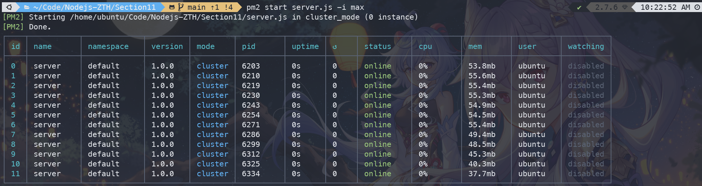

# Section 11

Node Improvement

-   blocking function such as JSON.stringify() or JSON.parse()

## Single thread processing vs multi thread processing

### Clustering

Use the node build in cluster module - master - worker (fork)

process.pid - build in method
Browser disable cache in network tab. To test for true network calls

Single thread wait for one to finish before going to the next task.
Multi thread split the work among workers with the cluster fork() method. Each fork is a worker. Using round robin approach of dividing the work. If there is 3 workers and 4 processes open, it goes 1,2,3 and then back to 1 again

Downside to clustering approach number of worker is number of processes that can execute in parallel.
Limit the number of fork to number of core in your cpu

Use the node build in os module for find number of cpu cores.

### Load Balancing

Refers to the process of distributing a set of tasks over a set of resources

-   round robin approach

Horizontal scaling(add more process) vs vertical scaling (add more speed to 1 process)

Cluster Module is great tool to use to improve performance of the server
Cluster Server 

PM2 tool `npm install pm2 -g`  under the hood using the cluster module. Use to manage the cluster. (P)rocess (M)anager 
    - pm2 start <name/file>
    - pm2 stop <name>
    - pm2 delete <name>
    - pm2 list (ls)
    - pm2 logs
    - pm2 restart <name>
    - pm2 show <id number>
    - pm2 stop <id number>
    - pm2 monit
    - pm2 reload <name> - this restart process 1 by 1 instead all at one time

`pm2 start server.js -l logs.txt -i max` add the `-i` flag will start the instances(worker) rather than master. `Max` or a number for the number of instances to start. `-l` flag where to save the logs  

## Zero Downtime restart 
Using reload is best to update server when server is already live and serving users

## Worker Threads 
Modules enables the use of threads that execute JS in parallel. Performing CPU intensive JS operations 
Worker threads are based on web workers api from the browser 

## overview
cluster 
- node services.js --> master --> fork() --> workers 
- run multiple instances of Node in multiple process

worker threads
- node index.js --> main thread --> new Worker() --> worker thread
- run multiple instances of Node in 1 process