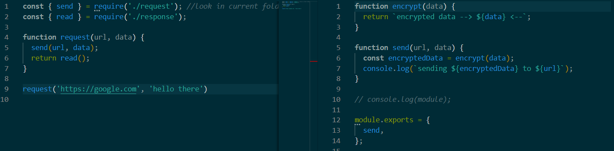
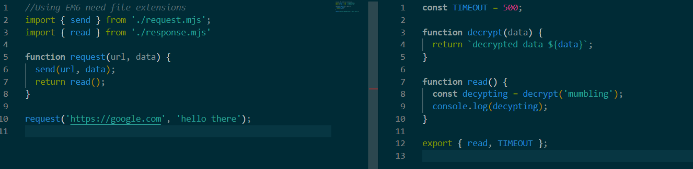

# Node Modules

1. Reuse exisiting code
2. Organize your code
3. Expose only what will be used

module is a build in object. Includes id/path/exports/filename/loaded ...  
require.extension includes `.js/.json/.node` files

module.exports has many ways of exporting the methods, having the export at the end is the easiest

## CommonJS modules vs ECMA Script modules / ES6

CommonJS

- use require
- module.exports



EMCA (aka: ES6 modules)

- use import and export statements



By default for backward compatiability .js file is set to CommonJS  
To use EM6 set "type": "module" in the package.json or use the .mjs extension.  
Using EM6 import need file extensions unless it is covered by a complier

Modules are cached.

- Its global.
- Lives under `console.log(require.cache)`

### How to load a group of modules from a folder
Using the folder as a `require` needs a special `index.js` file which loads up the rest of the modules in the folder

`````
module.exports = {
    key: value
}
`````
It is preferable to use direct path instead of index.js which adds complexity 

